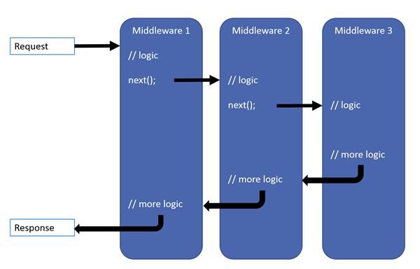
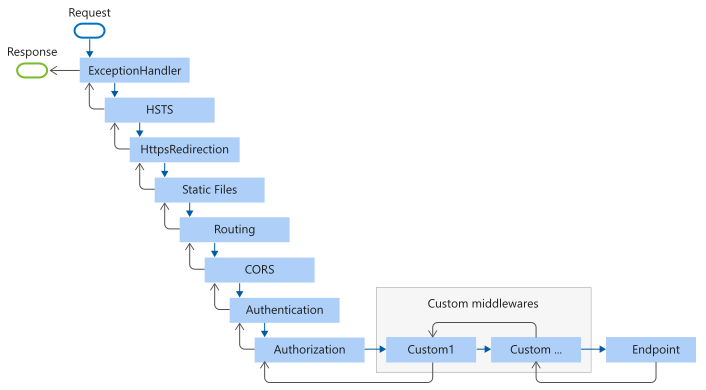
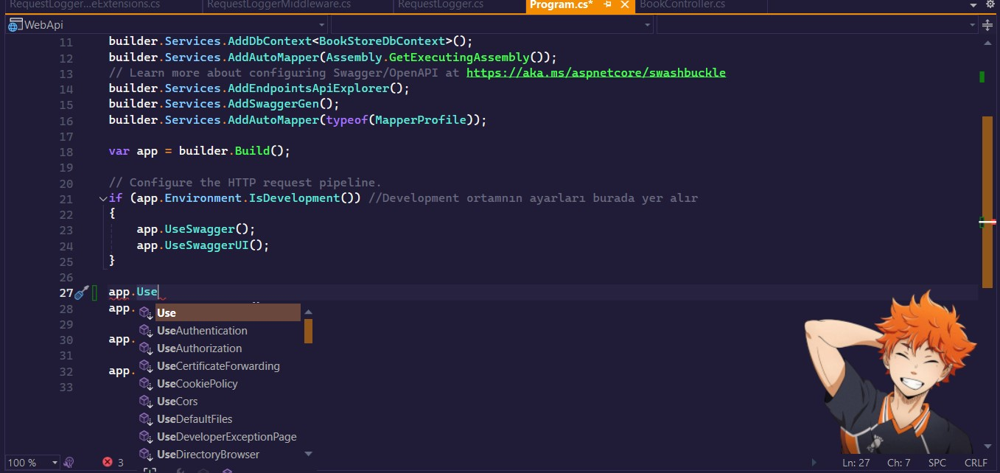
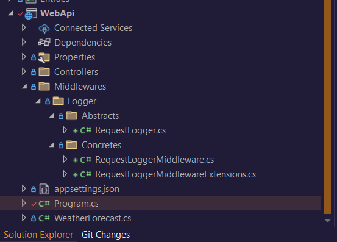
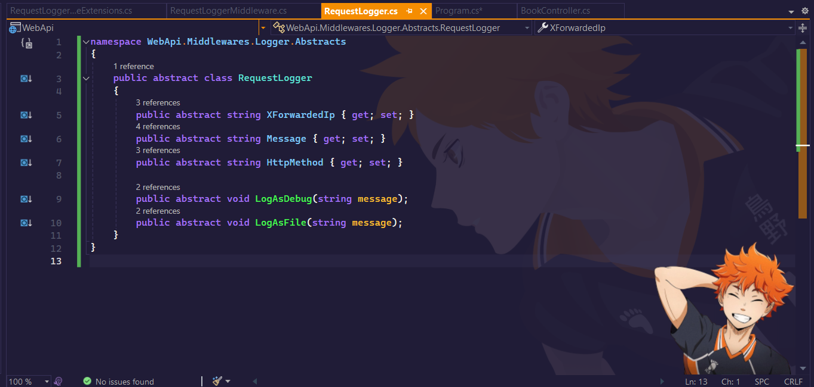
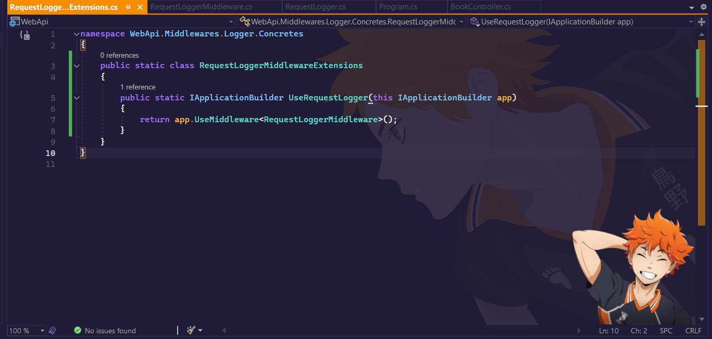
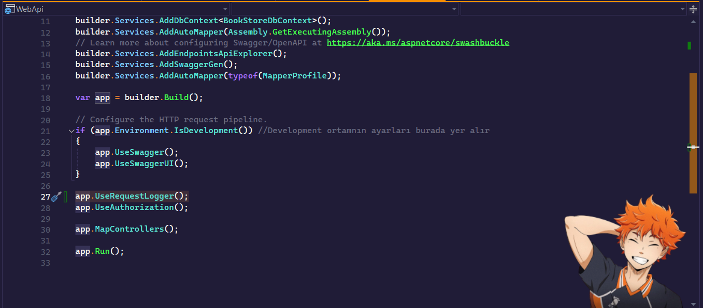
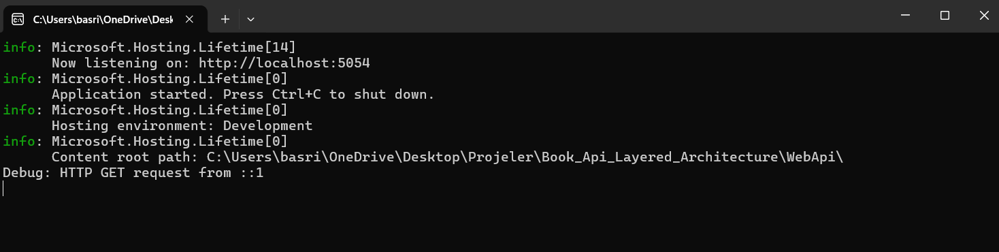
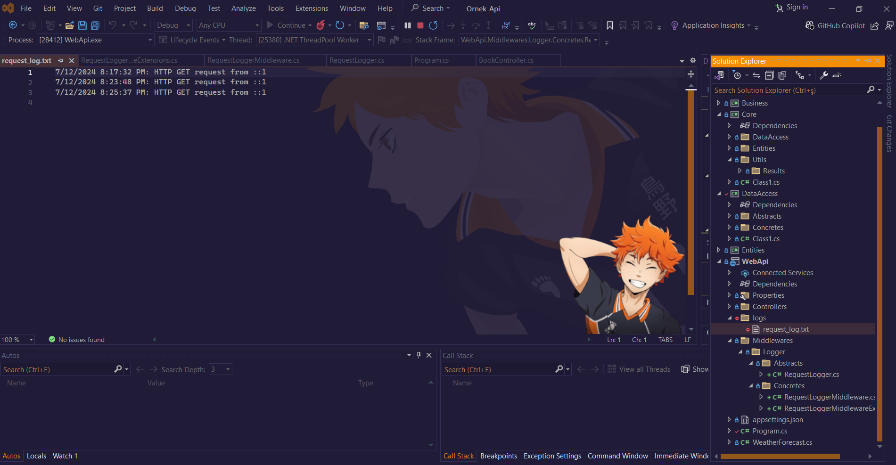

# Middleware Nedir
Client tarafından request gönderildiğinde response dönene kadar geçen sürede yapılması gereken işlemlerin process arasına girmeyi sağlayan yapıdır.







> [!WARNING]
> Middleware pipeline akışına dahil edilirken öncelikler doğru belirlenmek zorundadır çünkü çalışma sıralaması ciddi önem taşımaktadır


> [!TIP]
> Pipeline: Her middleware'ın işlem sırasında bir sonraki middleware'e `next()` aracılığıyla isteği ilettiği ve yanıtı beklediği işlem zinciri olarak tanımlanabilir. Bu yapı, HTTP istekleri veya veri işleme süreçlerinde kullanılan ve işlemlerin sıralı olarak yapılmasını sağlayan modüler bir yapıdır.

### Dotnet WebAPI ile gelen standart middleware'lar



Yukarıdaki resimde göründüğü üzere dostlar standart middleware'lar belli. Peki kendi middleware ara katmanımızı ekleyebilir miyiz ? Sorusuna cevaben evet ekleyebiliriz.

## Birlikte Middleware yapımızı oluşturalım

1. Program.cs  ve alt yapıyı kuralım (.NET 6)
   


2. RequestLogger Abstract sınıfını hazırlayalım. Bu sınıf Middleware için yol gösterici görevi görecektir.



3. Middleware sınıfını hazırlayalım. Bu sınıf, X-Forwarded-For başlığını kullanarak istemci IP adresini yakalayacak ve hangi HTTP metodunun çağrıldığını dosya kaydına (file logger) kaydedecektir. Pipeline yönetimi için Request Delegate kullanacağız.


#### Request Delegate Nedir Bilelim.

 HTTP isteğinin işlenmesi sırasında kullanılan bir temsilcidir. Middleware'ler arasında veri akışını sağlamak ve HTTP isteğinin bir sonraki middleware'e iletilmesini yönetmek için kullanılır. Başka bir deyişle, RequestDelegate, bir middleware'in isteği alıp işlemesi ve ardından isteği işlemek için bir sonraki middleware'e iletmesi için gereklidir.

#### RequestDelegate'in Kullanım Amacı:
**İstek İşleme**: Her HTTP isteği bir middleware zincirinden geçer. RequestDelegate, bu zincirin bir parçası olarak, isteğin işlenmesini sağlar.
**Middleware Zinciri**: İstek ilk middleware'den başlar ve RequestDelegate sayesinde sıradaki middleware'e iletilir. Bu, zincirin sonuna kadar devam eder.
**Kontrol Sağlama**: Her middleware, isteği işleyip işlememeyi ve ardından bir sonraki middleware'e geçip geçmemeyi kontrol eder. RequestDelegate, bu kontrolün sağlanmasında önemli bir rol oynar.

```csharp
using Microsoft.AspNetCore.Http;
using System.Threading.Tasks;
using WebApi.Middlewares.Logger.Abstracts;
using System.IO;
using System;

namespace WebApi.Middlewares.Logger.Concretes
{
    public class RequestLoggerMiddleware : RequestLogger
    {
        private readonly RequestDelegate _next;

        public RequestLoggerMiddleware(RequestDelegate next)
        {
            _next = next;
        }

        public override string XForwardedIp { get; set; }
        public override string Message { get; set; }
        public override string HttpMethod { get; set; }

        public override void LogAsDebug(string message)
        {
            Console.WriteLine($"Debug: {message}");
        }

        public override void LogAsFile(string message)
        {
            var logDirPath = Path.Combine(AppContext.BaseDirectory, "logs");
            var logFilePath = Path.Combine(logDirPath, "request_log.txt");

            try
            {
                Directory.CreateDirectory(logDirPath);
                File.AppendAllText(logFilePath, $"{DateTime.Now}: {message}\n");
            }
            catch (Exception ex)
            {
                Console.WriteLine($"An error occurred while writing to log file: {ex.Message}");
                throw;
            }
        }


        public async Task Invoke(HttpContext context)
        {
            XForwardedIp = context.Request.Headers["X-Forwarded-For"].FirstOrDefault() 
                ?? context.Connection.RemoteIpAddress.ToString();
            HttpMethod = context.Request.Method;
            Message = $"HTTP {HttpMethod} request from {XForwardedIp}";

            LogAsDebug(Message);
            LogAsFile(Message);

            await _next(context);
        }
    }
}

```
4. Son olarak, IApplicationBuilder'a tanımlanacak erişilebilir bir Extension sınıfı gereklidir. Bu extension, builder'ın middleware'i tanımlamasına olanak tanıyacaktır.
   



# Sonuç





**Developer dilerse hem console debug hem de file olarak loglama işlemini gerçekleştirebilir. Sisteme bağlı olarak bu işlemlerin thread Task üzerinden async olması sağlanabilir**

<details>
<summary>Multithread Middleware
</summary>

```csharp
using Microsoft.AspNetCore.Http;
using System.Threading.Tasks;
using WebApi.Middlewares.Logger.Abstracts;
using System.IO;
using System;
using System.Linq;

namespace WebApi.Middlewares.Logger.Concretes
{
    public class RequestLoggerMiddleware : RequestLogger
    {
        private readonly RequestDelegate _next;

        public RequestLoggerMiddleware(RequestDelegate next)
        {
            _next = next;
        }

        public override string XForwardedIp { get; set; }
        public override string Message { get; set; }
        public override string HttpMethod { get; set; }

        public override void LogAsDebug(string message)
        {
            // Log debug message in a separate thread
            Task.Run(() => Console.WriteLine($"Debug: {message}"));
        }

        public override void LogAsFile(string message)
        {
            Task.Run(() =>
            {
                var logDirPath = Path.Combine(AppContext.BaseDirectory, "logs");
                var logFilePath = Path.Combine(logDirPath, "request_log.txt");

                try
                {
                    Directory.CreateDirectory(logDirPath);
                    File.AppendAllText(logFilePath, $"{DateTime.Now}: {message}\n");
                }
                catch (Exception ex)
                {
                    Console.WriteLine($"An error occurred while writing to log file: {ex.Message}");
                    throw;
                }
            });
        }

        public async Task Invoke(HttpContext context)
        {
            XForwardedIp = context.Request.Headers["X-Forwarded-For"].FirstOrDefault() ?? context.Connection.RemoteIpAddress.ToString();
            HttpMethod = context.Request.Method;
            Message = $"HTTP {HttpMethod} request from {XForwardedIp}";

            LogAsDebug(Message);
            LogAsFile(Message);

            await _next(context);
        }
    }
}

```
</details>